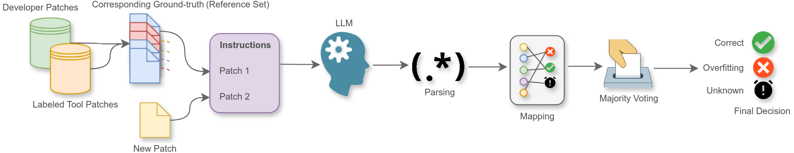

# Historian, Replication Package

Replication package for **_Historian: Reducing Manual Validation in APR Benchmarking via Evidence-Based Assessment_**.

Historian reformulates Automated Patch Correctness Assessment as a multi-reference semantic equivalence detection problem. For each candidate patch, it uses an LLM to perform exhaustive pairwise comparisons against a Historical Reference Set of previously validated tool patches, then applies a two-stage Evidence-Based Inference Logic (pairwise inference + majority voting) to produce a traceable `Correct` / `Overfitting` / `Unknown` verdict.

<p align="center">
  
</p>

## Highlights

- **Multi-reference, evidence-based verdicts.** Every `Correct` / `Overfitting` label is linked to concrete historical reference patches, not an opaque classifier score.
- **Conservative abstention.** Candidate patches without sufficient historical precedent are marked `Unknown` and routed to manual review.
- **empirical results.** In a 22-fold leave-one-tool-out evaluation on Defects4J, Historian reaches **95.0% coverage** with **88.4% accuracy**, and as a pre-filter boosts standalone APCA tools (ODS, Quatrain, Cache) by up to **+21.8 accuracy points**.
- **Sustainable.** A longitudinal analysis (2020–2024) shows ~39.6% of recent correct tool patches independently rediscover fixes already in the historical record.

## Requirements

- Python 3.10
- Java 8 (Defects4J) and Java 7 (for legacy benchmarks)
- Linux (tested on Ubuntu)
- [Ollama](https://ollama.com/) for local LLM inference (RQ1–RQ4)
- ~4× NVIDIA RTX 4090 (24 GB) recommended for the largest open-source models

```bash
pip install -r requirements.txt
git submodule update --init --recursive
```

Set up Defects4J v2.0.1 under `benchmarks/defects4j` following its [official instructions](https://github.com/rjust/defects4j), and seed Bugs.jar with the commit mapping:

```bash
cp -r benchmarks/ID2commit-bugsjar benchmarks/bugsjar/ID2commit
```

## Repository Layout

Scripts and data directories are named after the RQ they reproduce in the paper.

```
.
├── benchmarks/              APR bug benchmarks (Defects4J, Bugs.jar, Bears, QuixBugs, IntroClassJava)
├── datasets/                Peer-reviewed APCA datasets providing validated tool patches
│   ├── aprenfl/   defectrepairing/   dl4pc2/   drr/   wangicse/
│   └── datasets.json
├── tools/                   External tools (Ollama configs, SourcererCC, NiCad-based matching)
├── utils/                   Shared helpers (config paths, benchmark/dataset interfaces)
├── extra/                   Figures and supplementary tables used in the paper
├── setup/                   Pre-built pickles of the unified patch corpus
├── tmp/                     Intermediate artifacts, LLM responses, plots (regenerated by scripts)
│
├── build.py                 Patch preprocessing pipeline (clean → extract methods → normalize → dedup)
├── setup.py                 One-shot project initialization
├── classify.py              Zero-shot classification / parsing of free-text LLM responses
├── results.py               Aggregation, majority voting, per-configuration summary tables
├── dataset_analyzer.py      Dataset statistics (Table 3)
│
├── rq5_llms.py              Core LLM runner library (shared by most RQ scripts;
│                            script entry point drives the RQ5 longitudinal run)
│
│   # §2.1 Empirical Motivation — redundancy and diversity of tool-generated patches
├── motivation.py               Cluster patches by equivalence (Exact → SourcererCC → AST → manual)
├── motivation_plots.py         Cluster size distribution (Fig. 2)
├── motivation_cache_small.py   Variant used for the Cache-subset motivation analysis
│
│   # Paper RQ1 — Oracle experiment on expert-labeled TBar pairs (§5.1)
├── rq1/                     Expert-labeled TBar pairs, voted verdicts, paper tables
├── rq1_oracle.py            Two-stage Evidence-Based Inference Logic → Tables 5–6, Fig. 4
│
│   # Paper RQ2 — Sensitivity across LLM × prompt × representation (§5.2)
├── rq2/                     Stratified samples, manual labels, zero-shot accuracy stats
├── rq2_zeroshot.py                 Runs the 128 LLM×prompt×representation configurations
├── rq2_manual.py                   Draws stratified samples for manual validation of the parser
├── rq2_llm_manual.py               Adjudicates remaining parser outputs with an LLM
├── rq2_accuracy_for_manual.py      Produces Tables 9–11
├── rq2_zero_shot_plot.py           Violin plots (SS/SE binary tasks)
├── rq2_zero_shot_plot_boxplot.py   Clone-type (CC) plots
│
│   # Paper RQ3 — Leave-One-Tool-Out on 22 tools / 825 patches (§5.3)
│   # (Reuses the unified corpus built by build.py; no dedicated data dir.)
│   # The 22-fold LOTO verdicts are computed inside the rq4_historian_*
│   # scripts via the Experiment3Results helper, then majority-voted by
│   # results.py — see "Reproducing the Paper" below.
│
│   # Paper RQ4 — Historian as a pre-filter for standalone APCA tools (§5.4)
├── rq4/                     ODS/Quatrain/Cache inputs, per-tool predictions, hybrid results
├── rq4_dataset_fix.py                Sanitizes the LLM4PC dataset
├── rq4_dataset_analysis.py           Dataset statistics for the integration study
├── rq4_get_ODS.py                    Runs ODS on residual (Historian=Unknown) patches
├── rq4_historian_ods.py              Historian → ODS hybrid pipeline
├── rq4_historian_quatrain.py         Historian → Quatrain hybrid pipeline
├── rq4_historian_quatrain_bugreports.py  Quatrain bug-report input prep
├── rq4_historian_quatrain_tocsv.py       Quatrain predictions export
├── rq4_historian_cache.py            Historian → Cache hybrid pipeline
│
│   # Paper RQ5 — Longitudinal redundancy analysis 2020–2024 (§5.5)
├── rq5/                     Longitudinal corpus + plots (Venn, UpSet, temporal redundancy)
│     ├── tool_patches/                      Raw per-tool patch dumps for the post-2020 tools
│     ├── first_cleaned_tool_patches/        Auto-cleaned patches (rq5_gather.py output)
│     ├── second_cleaned_tool_patches/       Manually vetted patches (input to rq5_apply.py)
│     ├── patches_metadata/                  Per-tool pickles with correctness + SourcererCC labels
│     └── *_new_patches.pkl                  Staged pickles from the Historian preprocessing pipeline
├── rq5_gather.py            Collects and first-cleans post-2020 tool patches (ARJA-e → T5APR)
├── rq5_apply.py             Applies each post-2020 patch to its Defects4J checkout
├── rq5_assign_correctness.py Labels the post-2020 patches Correct/Overfitting from published artifacts
├── rq5_sourcerercc.py       Per-tool SourcererCC pass over the longitudinal corpus
├── rq5_sourcerercc_all.py   Cumulative SourcererCC pass over baseline + all post-2020 tools
├── rq5_plot_venn.py         Venn diagrams of recurring patches
├── rq5_plot_upset.py        UpSet plots
├── rq5_plot_bar.py          Temporal redundancy bar chart
└── rq5_plot_bar_pre.py      Pre-2020 baseline redundancy bar chart
```

## Quick Start

**Step 1 — Assemble the unified patch corpus.** This is a mandatory
prerequisite for every RQ (§2.1 motivation, RQ1, RQ2, RQ3, RQ4, and
RQ5). All RQ scripts load the cached pickles produced by `build.py`
(`tmp/data/*.pkl`, `tmp/bugs.pkl`, etc.), and `setup.py` performs the
one-shot benchmark/dataset registration the pipeline relies on.

```bash
python setup.py                     # One-shot project/benchmark registration
python build.py                     # Clean → extract methods → normalize → dedup
```

`build.py` cleans each patch, extracts the modified method, standardizes
identifiers, and deduplicates per tool. Intermediate pickles are cached
under `tmp/data/` and `setup/`, so subsequent runs are incremental.

**Step 2 — (Optional) report dataset statistics.** Reproduces the
Correct/Overfitting × benchmark × generator breakdown reported as
Table 3 in the paper.

```bash
python dataset_analyzer.py          # Summary table (Table 3)
```

**Step 3 — Start Ollama and pull the required models.**

```bash
ollama pull qwen2.5-coder:7b
ollama pull deepseek-coder:6.7b
# …see tools/ollama/models.json for the full list
```

## Reproducing the Paper

The scripts are grouped below by the RQ in the paper (not by their filename prefix). Unless stated otherwise, outputs land in `tmp/plots/` and each RQ's data directory.

### §2.1 Empirical Motivation — Redundancy and Solution Diversity

Recreates Figure 2 and the cluster statistics (245 → 96 unique solution
clusters). Requires the unified corpus from `build.py`.

```bash
python motivation.py                # Four-stage cascading clustering pipeline (Exact → Type-1 → SourcererCC → manual)
python motivation_plots.py          # Cluster size distribution plot (Fig. 2)
python motivation_cache_small.py    # Optional: Cache-subset variant of the same clustering analysis
```

### RQ1 — Performance Ceiling (TBar oracle)

Applies the two-stage Evidence-Based Inference Logic to 4,248 expert-annotated pairwise relationships for 139 TBar candidates. Produces Tables 5–6 and Figure 4.

```bash
python rq1_oracle.py
```

Expert labels: `rq1/rq1_expert_labeled_tbar.csv`.
Voted verdicts and confusion matrix: `rq1/rq1_expert_labeled_tbar_voted.{csv,pkl}`.

### RQ2 — Sensitivity (LLM × Prompt × Representation)

Runs all 128 configurations (8 models × 8 prompts × 2 representations)
and evaluates the two-stage parser. The scripts below form a pipeline
and must be run in order: ① generate zero-shot responses, ② draw
stratified samples for parser validation, ③ adjudicate the remaining
parser outputs with an LLM, ④ compute the accuracy tables and plots
from the consolidated labels.

```bash
# ① Run the 128 LLM × prompt × representation configurations via Ollama
python rq2_zeroshot.py

# ② Draw stratified samples for manual parser validation (Table 8 sampling)
python rq2_manual.py

# ③ Adjudicate remaining parser outputs with a commercial LLM (Gemini)
python rq2_llm_manual.py

# ④ Aggregate → Tables 9–11 and the zero-shot score plots (Figs. in §5.2)
python rq2_accuracy_for_manual.py         # Accuracy LaTeX table covering SS/SI/CC tasks (Tables 9–11)
python rq2_zero_shot_plot.py              # Violin plots for SS/SI binary tasks
python rq2_zero_shot_plot_boxplot.py      # Boxplots for the CC clone-type task
```

### RQ3 — Leave-One-Tool-Out (22 APR tools)

Simulates assessment of each tool with the Historical Reference Set
dynamically reconstructed from the remaining 21 tools. Reproduces
Table 13. The candidate patches and their Correct/Overfitting labels
come from the unified corpus already assembled by `build.py`, so no
separate gather/apply/assign step is needed.

**Where the LOTO actually runs.** There is no dedicated `rq3_*` driver
in the repository. The 22-fold leave-one-tool-out verdicts are computed
inside the `rq4_historian_*` scripts: each of them instantiates the
shared `Experiment3Results` helper over the 22-tool reference set
*before* its APCA-filter hybrid step, so the raw LOTO predictions fall
out as an intermediate artifact. Running any one of `rq4_historian_ods`,
`rq4_historian_quatrain`, or `rq4_historian_cache` is sufficient to
produce the pairwise predictions; `results.py` then majority-votes them
into Table 13.

```bash
python build.py                    # Unified corpus (skipped if cached)
python rq4_historian_ods.py        # Drives 22-fold LOTO via Experiment3Results (by-product of RQ4)
python results.py                  # Aggregates majority-voted verdicts → Table 13
```

If you are going to reproduce RQ4 anyway, you can skip this block — the
RQ4 reproduction below runs all three `rq4_historian_*` scripts and
will produce everything needed for Table 13 as a side-effect.

### RQ4 — Historian as a Pre-Filter for APCA Tools

Integrates Historian with three representative APCA tools (ODS,
Quatrain, Cache). Reproduces Tables 14–15. The Quatrain branch has
extra preprocessing and export steps because Quatrain consumes
bug-report text and produces per-patch CSV predictions — these must
bracket the main `rq4_historian_quatrain.py` run.

```bash
# ① Dataset preparation
python rq4_dataset_fix.py                      # Sanitize the LLM4PC dataset
python rq4_dataset_analysis.py                 # RQ4 dataset statistics (825 patches × 22 tools)

# ② ODS branch
python rq4_get_ODS.py                          # Run ODS on residual (Historian=Unknown) patches
python rq4_historian_ods.py                    # Historian → ODS hybrid

# ③ Quatrain branch (bug-report prep → hybrid run → CSV export)
python rq4_historian_quatrain_bugreports.py    # Prep Quatrain bug-report inputs
python rq4_historian_quatrain.py               # Historian → Quatrain hybrid
python rq4_historian_quatrain_tocsv.py         # Export Quatrain predictions to CSV

# ④ Cache branch
python rq4_historian_cache.py                  # Historian → Cache hybrid
```

### RQ5 — Longitudinal Redundancy (2020–2024)

Chronologically introduces seven recent tools (ARJA-e → T5APR) into the reference set and measures redundancy using deterministic (textual / SourcererCC / AST) clone detection. Reproduces Tables 17–18 and the temporal redundancy figure.

```bash
# 1. Prepare the post-2020 tool corpus
python rq5_gather.py                 # Collects + first-cleans per-tool patches
python rq5_apply.py                  # Applies each patch to its Defects4J checkout
python rq5_assign_correctness.py     # Labels patches Correct/Overfitting

# 2. Run redundancy detection and build plots
python rq5_sourcerercc.py            # Per-tool SourcererCC pass
python rq5_sourcerercc_all.py        # Cumulative pass
python rq5_llms.py                   # LLM pairwise comparisons: post-2020 tools vs. pre-2020 reference
python rq5_plot_venn.py              # Venn diagrams
python rq5_plot_upset.py             # UpSet plots
python rq5_plot_bar.py               # Temporal redundancy bar chart
python rq5_plot_bar_pre.py           # Pre-2020 baseline
```

## Regenerating LLM Responses from Scratch

Raw LLM responses are stored under `tmp/results/` as pickle files. To regenerate them, ensure Ollama is running with the models in `tools/ollama/models.json` pulled locally, then re-run the appropriate RQ script. `build.py` will skip cleaning/extraction phases when the cached pickles in `tmp/data/` already exist.

## Datasets and LLMs

- **Historical Reference Set**: merged from five peer-reviewed APCA datasets — Xiong et al., Liu et al., Tian et al., Ye et al., Wang et al. — yielding 704 bugs / 1,351 correct / 20,403 overfitting patches after single-method and deduplication filters. See Table 3 in the paper.
- **LLMs evaluated**: Magicoder 7B, CodeLlama 7B, DeepSeek-Coder 6.7B, CodeGemma 7B, Qwen 2.5 7B, Qwen 2.5 Coder 7B, Yi Coder 9B, Hermes 3 8B, and Gemini 2.0 Flash (commercial baseline).
- **Zero-shot fallback parser**: `facebook/bart-large-mnli` (NLI-based label extraction when regex parsing is ambiguous).

## License

Released under the terms of the `LICENSE` file at the repository root.
